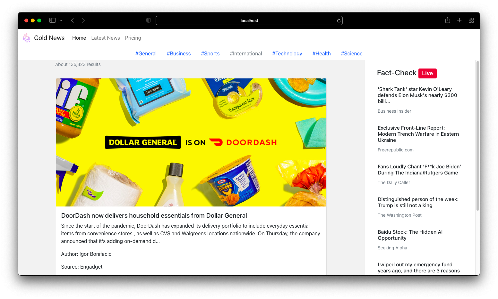
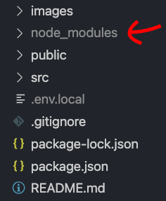

# Gold News 

### If this project has helped you and you'd like to support my work, feel free to ♥️ Sponsor the project
### A improved version 2 on the way 🎉

## Description

This is reactJs & bootstrap based news website. This website is fully responsive in any device. Data will fetch from api powered by [Newsapi](https://newsapi.org/). This means that you don't need to manage any database it can be customized and used by anybody simply by some changes in api through api the changes will be dynamically fed into the site. If you would like to use this project for your own personal project, read on to learn how to build your own copy.

## Make it your own!
### 1. Make sure you have what you need
To build this website, you will need to have Node >=6 downloaded and installed on your machine. If you don't already have it, you can get it [HERE](https://nodejs.org/en/download/)

### 2. Clone repository
Once you download nodejs in your machine all you have to do download my code by hitting the green "clone or download" button above and hit download zip.

### 3. Run following command
Next you need to run this command in your terminal. This will download packages and it's dependencies

Note: terminal should point to that folder
```bash
npm install
```


### 4. Get your api key
This step is very simple what you need is just to go on [newsapi.org](https://newsapi.org/) and after signup you will can see your api key then copy! that api key

Now make a file called  ```.env.local ```  in you folder 


and paste this code in that file 
```bash
REACT_APP_NEWS_API='paste your api key here'
```


### 4. Enjoy your news website
now run this command to start your app
```bash
npm start
```

## Terms & Conditions
1. Of course, all of the code is there and nothing is hidden from you so if you would like to make any other styling changes, feel free!
2. No need to give any credit
4. you can not sell this project

## Contribution
Pull requests are welcome. For major changes, please open an issue first to discuss what you would like to change.

## Contact me
Website: [https://yashsharma.netlify.app/](https://yashsharma.netlify.app/)

Email: yashsharma2572@gmail.com

Instagram: [yashsharma_f](https://www.instagram.com/yashsharma_f/)

Linkedin: [Yash sharma](https://www.linkedin.com/in/yash-sharma-4276b61b5/)
